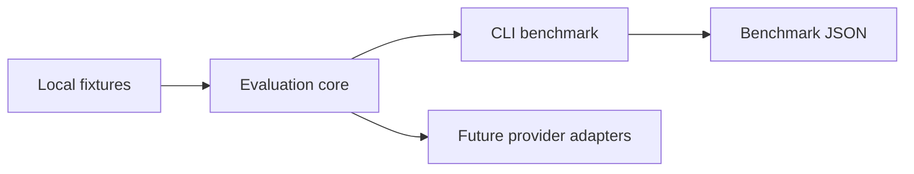

# #8 embeddings-benchmark

**Claim:** Embedding comparison benchmark that ranks deterministic retrieval models by Recall@k, indexing time, and query time.

**Benchmark:** `best_recall_at_3` = `1.0` on local deterministic fixtures. Result file: `benchmarks/results/embeddings-baseline.json`.

## What It Proves

This repository is part of **AI Evaluation and Retrieval Systems**. It provides one measurable layer of the AI Evaluation & RAG Platform while keeping the default path local-first, Dockerized, and free of paid credentials.

## Architecture



Dependency rule: evaluation core does not import provider SDKs, cloud SDKs, web frameworks, or GitHub automation.

## Run Locally

```powershell
$env:PYTHONPATH = "src"
python -m embeddings_benchmark benchmark --output benchmarks/results/embeddings-baseline.json
```

## Run With Docker

```powershell
docker build -t embeddings-benchmark .
docker run --rm embeddings-benchmark
```

## Benchmark Result

See `benchmarks/results/embeddings-baseline.json`.

## Reuse Contract

- Uses `portfolio-reuse-kit` for agent graph, SDD, validation, design system, and publication gate.
- Records reusable improvement decisions in `sdd/reuse-improvement-review.md`.
- Runs without paid secrets by default.
