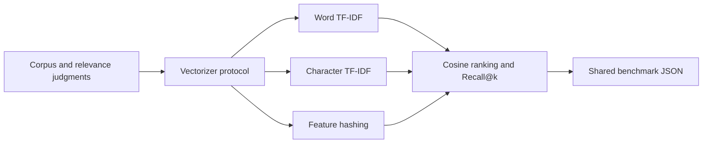

# #8 embeddings-benchmark

**Claim:** Deterministic non-neural retrieval-vectorizer comparison with correct Recall@k, indexing time, and query time.

**Benchmark:** `best_recall_at_3` = `1.0`; character TF-IDF recovered every relevant document in the top three on the committed fixture. Evidence: `benchmarks/results/embeddings-baseline.json`.

## What It Proves

This repository compares three real numeric vectorization strategies under the same corpus, queries, cosine ranking, and `k`: word TF-IDF, character TF-IDF, and deterministic feature hashing.

The committed baseline is intentionally **non-neural**. It proves retrieval-evaluation methodology and local reproducibility; it does not claim transformer embedding quality. The fixture is small, so the `1.0` result is a regression baseline, not evidence of production retrieval quality.

## Architecture



Dependency rule: benchmark orchestration depends on the vectorizer protocol. Future neural or hosted encoders must implement that boundary without entering the metric code.

## Run Locally

```powershell
$env:PYTHONPATH = "src"
python -m embeddings_benchmark benchmark --k 3 --output benchmarks/results/embeddings-baseline.json
```

## Run With Docker

```powershell
docker build -t embeddings-benchmark .
docker run --rm embeddings-benchmark
```

## Benchmark Method

For each query, Recall@k is `relevant documents in top k / all relevant documents`. A query with two relevant documents receives `0.5`, not `1.0`, when only one is retrieved. The reported score is the macro average of those per-query samples.

Indexing and query times are recorded for diagnostics but are environment-dependent. Quality comparisons use identical inputs and deterministic tie-breaking by document ID.

## Reuse Contract

- Implements a provider-neutral vectorizer protocol.
- Emits the shared portfolio result fields: project, metric, value, unit, timestamp, command, samples, and environment.
- Runs without paid credentials or heavyweight model downloads.
- Records continuation state in `sdd/agent-handoff.md`.
