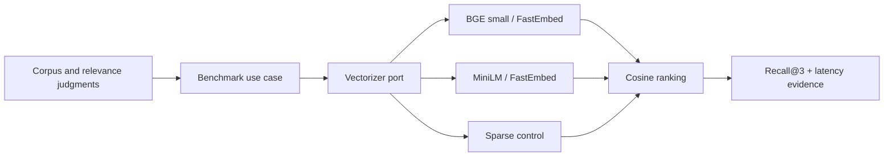

# #8 embeddings-benchmark

**Claim:** Two versioned dense embedding models run locally through FastEmbed/ONNX behind one provider-neutral port and are compared with the same Recall@3 and end-to-end query timing policy.

**Benchmark:** both `BAAI/bge-small-en-v1.5` and `sentence-transformers/all-MiniLM-L6-v2` reached `Recall@3 = 0.875`; BGE served the four-query fixture at a median `3.9213 ms/query` versus `18.8207 ms/query` for MiniLM (`4.80x` faster). Raw evidence: `benchmarks/results/embeddings-baseline.json`.

## What It Proves

- Actual 384-dimensional neural embeddings execute on CPU without a paid API.
- Query and passage encoding use the same FastEmbed boundary while Recall@k and ranking remain provider-independent.
- One warmup plus five measured repetitions expose quality, median query latency, throughput, and cold indexing time per model.
- The Docker image preloads both model artifacts and completes with `--network none`.
- A deterministic sparse profile remains available as a fast regression control.

The fixture has six documents and four queries. This is a reproducible portfolio baseline, not a claim about production retrieval quality or the full MTEB suite.

## Architecture


```mermaid
flowchart LR
  Fixtures["Corpus and relevance judgments"] --> Core["Benchmark use case"]
  Core --> Port["Vectorizer port"]
  Port --> BGE["BGE small / FastEmbed"]
  Port --> MiniLM["MiniLM / FastEmbed"]
  Port --> Sparse["Sparse control"]
  BGE --> Rank["Cosine ranking"]
  MiniLM --> Rank
  Sparse --> Rank
  Rank --> Metrics["Recall@3 + latency evidence"]
```

Dependency rule: metric and ranking code depend on the vectorizer protocol, never on FastEmbed, ONNX Runtime, Hugging Face, or a hosted provider SDK.

## Run Locally

```powershell
python -m venv .venv
.\.venv\Scripts\python -m pip install -r requirements.lock
.\.venv\Scripts\python -m pip install --no-build-isolation --no-deps -e .
.\.venv\Scripts\python -m embeddings_benchmark benchmark --profile dense --k 3 --repeat 5 --warmup 1 --output benchmarks/results/embeddings-baseline.json
```

The first local dense run downloads the two public model artifacts into the FastEmbed cache.

## Run With Docker

```powershell
docker build -t embeddings-benchmark .
docker run --rm --network none embeddings-benchmark
```

Model artifacts are fetched during `docker build`; benchmark execution is offline and runs as an unprivileged user.

## Benchmark Method

For each query, Recall@k is `relevant documents returned in the first k / all relevant documents`. A query with two relevant documents scores `0.5` when only one is recovered. The primary value is the macro average of four query-level samples.

Cold indexing includes model initialization, passage embedding, and index assembly. Each measured query timing includes query embedding, cosine scoring, and deterministic ranking. The report uses the median of five per-query timings after one warmup; ties in Recall@3 are broken by measured query latency only when naming the best model.

## Reuse Contract

- Dense and sparse implementations satisfy one vectorizer port (DIP/OCP/LSP).
- Metric, fixtures, CLI, and provider adapter have separate responsibilities (SRP/ISP).
- Dependencies and Docker base are pinned; V2 evidence binds source, image, fixtures, config, lock, and raw artifact by digest.
- No queue, database, HTTP API, cloud account, or orchestration layer is added because none improves this benchmark.
