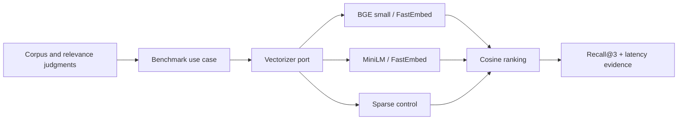

# Embeddings Benchmark: Local Neural Embedding Models behind One Provider-Neutral Port

**Both models reached `Recall@3 = 0.875`; `BAAI/bge-small-en-v1.5` answered queries in a median `3.0561 ms` versus `15.0578 ms` for `sentence-transformers/all-MiniLM-L6-v2`** (4.93x faster), on CPU, offline, with revision-locked model artifacts.

[](https://github.com/Brilhante29/embeddings-benchmark/actions/workflows/validate.yml)
[](LICENSE)


## Why this exists

Choosing an embedding model is usually done by reading a leaderboard and paying for an API. For a retrieval system the relevant questions are narrower: does a small local model retrieve well enough on my data, how much latency does it add per query, and can I swap it later without rewriting ranking and metrics? This repository answers them with:

- two real 384-dimensional models running on CPU through FastEmbed and ONNX Runtime, with no paid API;
- one vectorizer port shared by dense models and a deterministic sparse control, so ranking and Recall@k never depend on a provider SDK;
- `model-artifacts.lock.json`, which pins the exact model revisions and makes the Docker build fail on upstream drift;
- a container that preloads both models at build time and runs the benchmark with `--network none`.

## Results

| Model | Recall@3 | Median query time | Query throughput | Cold indexing |
|---|---:|---:|---:|---:|
| `BAAI/bge-small-en-v1.5` | 0.875 | 3.0561 ms | 327.21 q/s | 1,174.0 ms |
| `sentence-transformers/all-MiniLM-L6-v2` | 0.875 | 15.0578 ms | 66.41 q/s | 324.1 ms |

Recall@3 is the macro average of four query-level samples; a query with two relevant documents scores `0.5` when only one is returned. Query timing covers embedding, cosine scoring, and deterministic ranking, as the median of five runs after one warm-up. Cold indexing covers model initialization, passage embedding, and index assembly.

Worth noting: MiniLM indexes faster but queries slower, even though it is the shallower network. The two FastEmbed ONNX builds are the likely cause, and the gap deserves profiling before anyone generalizes it.

## Quickstart

```bash
docker build -t embeddings-benchmark .
docker run --rm --network none embeddings-benchmark
```

Model artifacts are fetched during `docker build`; the benchmark itself is offline and runs as an unprivileged user.

Local run (the first dense run downloads both public models into the FastEmbed cache):

```bash
python -m venv .venv && . .venv/bin/activate
pip install -r requirements.lock
pip install --no-build-isolation --no-deps -e .
python -m embeddings_benchmark benchmark --profile dense --k 3 --repeat 5 --warmup 1 \
  --output benchmarks/results/embeddings-baseline.json
```

## How it works


```mermaid
flowchart LR
  Fixtures["Corpus and relevance judgments"] --> Core["Benchmark use case"]
  Core --> Port["Vectorizer port"]
  Port --> BGE["BGE small / FastEmbed"]
  Port --> MiniLM["MiniLM / FastEmbed"]
  Port --> Sparse["Sparse control"]
  BGE --> Rank["Cosine ranking"]
  MiniLM --> Rank
  Sparse --> Rank
  Rank --> Metrics["Recall@3 + latency evidence"]
```

Dependency rule: metric and ranking code depend on the vectorizer protocol, never on FastEmbed, ONNX Runtime, Hugging Face, or a hosted provider SDK. Ties in Recall@3 are broken by measured query latency only when naming the best model.

## Design decisions

| Decision | Why | Rejected |
|---|---|---|
| Ports and adapters around the vectorizer | New models plug in without touching metrics | Provider SDK calls inside ranking code |
| Revision-locked artifacts | Upstream model updates cannot silently change results | Floating model names |
| Models baked into the image | Benchmark runs offline and identically everywhere | Download at runtime |
| Sparse control profile | Fast regression check that needs no model | Dense-only test suite |
| No API, database, or queue | None improves the measurement | Infrastructure for its own sake |

## Limitations

- Six documents and four queries: good for a reproducible comparison harness, not for MTEB-style conclusions.
- English-only fixture; multilingual or Portuguese retrieval is not covered.
- CPU only, single process.

## Reproducibility

- Publication evidence: [`benchmarks/publication/embeddings-baseline-v2.json`](benchmarks/publication/embeddings-baseline-v2.json), binding source, image, fixtures, config, lock, and raw artifact by digest.
- Raw execution: [`benchmarks/results/embeddings-baseline.json`](benchmarks/results/embeddings-baseline.json).

## Project structure

```text
src/embeddings_benchmark/   benchmark use case, vectorizers (port + adapters), CLI
tests/                      metric, ranking, and port contract tests
data/fixtures/              corpus and relevance judgments
benchmarks/                 raw results and V2 publication evidence
sdd/  openspec/             specification, architecture and technical decisions
```

## How this repository is built

The project follows the spec-driven workflow of [portfolio-reuse-kit](https://github.com/Brilhante29/portfolio-reuse-kit). Requirements and decisions live in [`sdd/`](sdd) and [`openspec/`](openspec), and [`project.yaml`](project.yaml) records the architecture, stack, and rejected alternatives. Development is AI-assisted and human-governed: [`AGENTS.md`](AGENTS.md) and [`CLAUDE.md`](CLAUDE.md) hold the coding-agent instructions, while tests, validators, and CI decide what gets published.

## Related work

- [rag-knowledge-base](https://github.com/Brilhante29/rag-knowledge-base): the retrieval layer these models can plug into.
- [llm-eval-harness](https://github.com/Brilhante29/llm-eval-harness): scoring the outputs downstream.

See [`REFERENCES.md`](REFERENCES.md) for model and library attribution.

## Author

**Guilherme Brilhante**, software engineer working on scalable backends and production AI.
[LinkedIn](https://www.linkedin.com/in/guilhermefreirebrilhanteseveriano/) · [GitHub](https://github.com/Brilhante29) · [Publications](https://dblp.org/pid/353/6812.html)

## License

[MIT](LICENSE). Model weights keep their own licenses; see [`REFERENCES.md`](REFERENCES.md).
